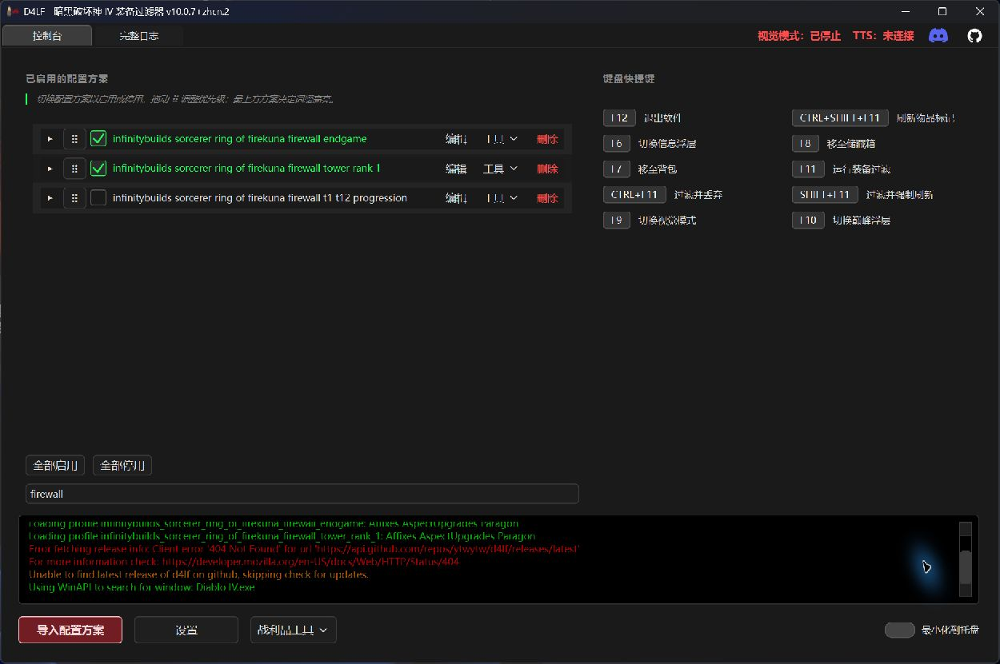
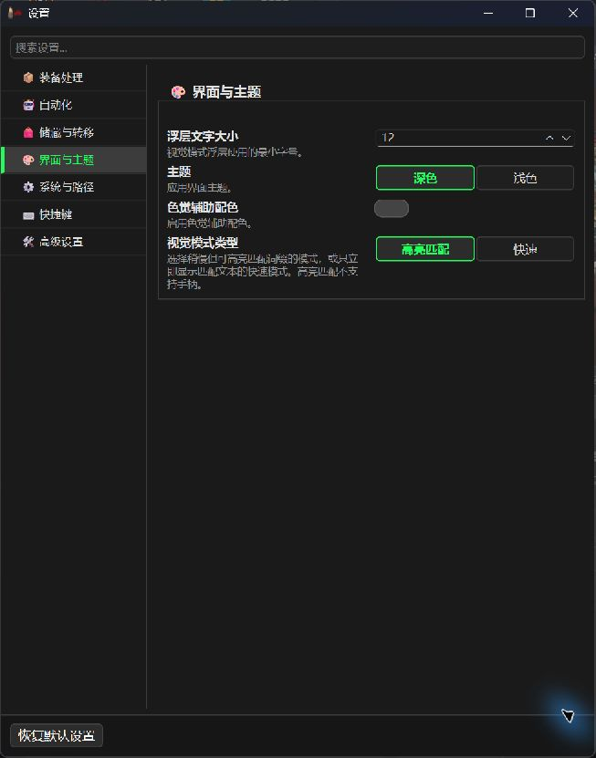
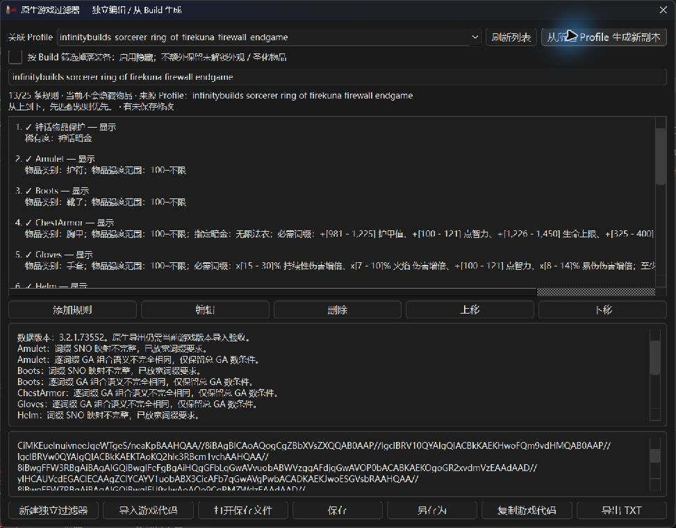
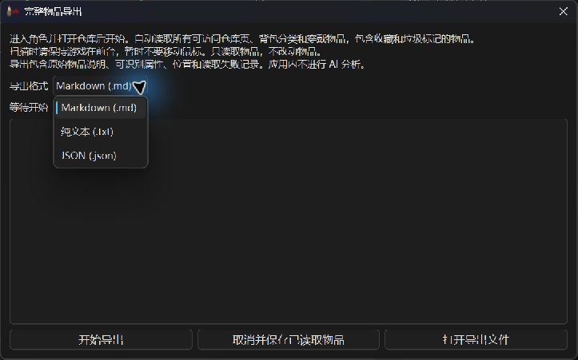
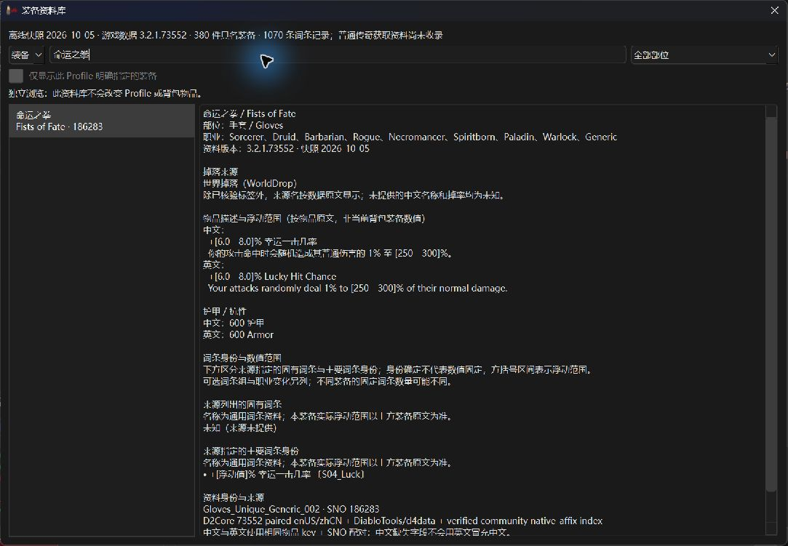

# D4LF 简体中文增强版

[English](README.en.md) · [安装](#%E5%AE%89%E8%A3%85) · [中文界面预览](#%E7%95%8C%E9%9D%A2%E4%B8%8E%E9%85%8D%E7%BD%AE) · [战利品工具说明](docs/loot-tools.zh-CN.md)

`main` 是面向用户的当前版本分支。安装程序请使用 [Releases](https://github.com/ytwytw/d4lf/releases) 中的完整程序包。

D4LF 是一个 Windows 桌面装备过滤辅助工具。它通过屏幕画面和《暗黑破坏神 IV》的
无障碍 TTS 文本识别物品，并按照本地 Profile 显示保留或丢弃结果。本分支在上游
[D4LF](https://github.com/d4lfteam/d4lf) V10 基础上增加简体中文客户端解析、双语界面和
跨语言 Build 导入。

> 本项目不是暴雪官方工具。使用任何第三方辅助工具都无法保证账号零风险，请自行判断并承担风险。

## 主要功能

- 支持简体中文与英文游戏客户端；设置中的语言会同时切换界面和游戏文本解析。
- 按装备类型、物品强度、稀有度、词缀、暗金特效和数值阈值过滤装备。
- 支持物品栏、储物箱、快速视觉模式、匹配高亮、信息面板和巅峰盘悬浮层。
- 从 [Maxroll](https://maxroll.gg/d4/)、[Mobalytics](https://mobalytics.gg/diablo-4/builds)、
  [D4Builds](https://d4builds.gg/)、[InfinityBuilds](https://infinitybuilds.gg/) 和
  [暗黑核 D2Core](https://www.d2core.com/d4/planner) 导入 Build。
- Build 来源语言与游戏语言相互独立：英文 Build 可用于中文或英文客户端，中文 D2Core
  Build 也可用于中文或英文客户端。
- 战利品工具提供游戏过滤器生成／独立编辑、完整物品导出、装备来源与词条资料库。
  使用方法及资料覆盖边界见[战利品工具说明](docs/loot-tools.zh-CN.md)。

## 安装

当前版本为 **`10.0.7+zhcn.2` 候选版**，尚未发布下载包。正式发行包发布后可从
[Releases](https://github.com/ytwytw/d4lf/releases) 下载；请使用包含 EXE 和资源的完整程序包。
新功能和已知限制见[版本说明](docs/release-notes.zh-CN.md)。

1. 将已核对版本的完整本地候选包解压到新目录；正式发行包仅在本仓库 [Releases](https://github.com/ytwytw/d4lf/releases) 实际发布后下载。
1. 找到《暗黑破坏神 IV》安装目录。
1. 先退出游戏；安装脚本会替换游戏目录中的 `saapi64.dll` 并可能关闭仍在运行的游戏。
1. 双击 `install_dll.cmd`，按提示提供游戏目录并允许安装本地签名证书。
1. 启动 `d4lf.exe`，在 **设置 → 系统与路径 → 语言** 中选择游戏客户端实际使用的语言。
1. 在游戏中启用高级说明信息、屏幕阅读器和第三方屏幕阅读器；字体大小使用小或中，关闭 HDR。
1. 导入 Build 或创建 Profile，在主界面启用需要使用的 Profile。
1. 首次使用先在 **设置 → 自动化** 启用“仅视觉模式”，用快速视觉模式悬停已装备物品和背包装备，确认解析和保留提示正确。
1. 核对 Profile 后再关闭“仅视觉模式”并使用主界面热键；默认 `F11` 会自动标记未匹配装备，不是只读预览。

如果 TTS 一直无法连接，可尝试以管理员身份运行游戏和启动器。配置损坏时，退出 D4LF 后备份并重命名
`%USERPROFILE%\.d4lf\params.ini`，再通过设置界面重新配置。

## 第 15 赛季版本与升级

当前版本基于上游 `10.0.7`，包含 Build 导入、中文识别与应用内重启修复。
部分新物品可能尚未收录，名称相同但效果不同的物品需要完整说明才能识别。
建议先用“仅视觉模式”核对结果，再启用自动标记。

- 升级前退出 D4LF，备份整个 `%USERPROFILE%\.d4lf`，保留旧完整程序目录。
  此目录含 `params.ini`、`profiles`、`native_filters`、`exports\inventory` 及诊断留样；自行另存的文件需另备份。
- 将同一版本的 EXE 和 assets 一起解压到新目录；同一 Windows 账户仍读取原来的 `.d4lf`，无需将个人数据复制进程序目录。
  首次启动核对版本、语言、热键和已启用 Profile，再用“仅视觉模式”检查识别结果。V9 升 V10 应重新导入不兼容的 Profile。
- 从旧版本升级到此版本建议手动下载、解压到新目录；旧版 `autoupdater.bat` 的行为不会被本次修复追溯改变。
- 本版本随附的 `autoupdater.bat` 仅检查本仓库更新，不降级，不删除安装目录中的额外文件。
  复制失败会保留 `temp_update` 供恢复；需要时从发布 ZIP 手动解压修复，不要混用不同版本的 EXE 和 assets。
- 应用升级不会替换游戏目录中的 DLL；只有发布说明要求更新 DLL 时，才在关闭游戏后重新运行 `install_dll.cmd`。
- 回退时先退出新版，并另备份新版运行后的 `.d4lf`，再启动保留的旧完整程序目录。
  若旧版不能读取更新后的配置或文档，在保存两份备份后恢复升级前的 `.d4lf`；不要把新旧配置或资源混成一份。
  自动更新器不执行降级；回退也不自动恢复游戏 DLL，应遵循所回退版本的安装说明。

战利品工具的保存位置、导出状态和故障排查集中在[使用说明](docs/loot-tools.zh-CN.md)。
物品导出以 TTS 原文为主，不会自动用截图补齐缺失字段，也不读取游戏内部状态。

## 跨语言 Build 导入

导入器先把网站数据解析成稳定的内部标识，再根据当前界面和游戏语言显示名称。因此：

| Build 来源                                         | 中文客户端 | 英文客户端 |
| -------------------------------------------------- | ---------- | ---------- |
| 英文 Maxroll、Mobalytics、D4Builds、InfinityBuilds | 支持       | 支持       |
| 中文 D2Core                                        | 支持       | 支持       |

网站内容变化、赛季更新或无法精确匹配的词条会被跳过并记录日志，不会用模糊翻译强行猜测。
导入后请在 Profile 编辑器中检查结果。

## 数据与致谢

感谢 [D4LF](https://github.com/d4lfteam/d4lf)、[暗黑核 D2Core](https://www.d2core.com/d4/planner)
及其他社区资料项目。装备资料为离线快照，缺少译名、掉落地点或概率时显示未知。
数据来源、版本和归属见[资料来源说明](assets/equipment_knowledge/NOTICE.md)。

## 诊断与隐私

- 自动失败留样默认关闭。
- 独立诊断页默认隐藏，需在高级设置中明确启用。
- 留样和诊断数据只保存在本机的 `%USERPROFILE%\.d4lf\captures`。
- 功能不会上传数据，也不会录制麦克风。
- 自动留样仅在识别失败时保存必要的屏幕截图、TTS 文本和清单；手动诊断录制可独立启停。

截图可能包含游戏角色名、聊天或其他屏幕内容。公开报告问题前请先检查并脱敏。
库存导出也只保存在本机。反馈问题时只提供必要且已脱敏的信息，无需分享整个 `.d4lf` 目录。

## 界面与配置

以下为 **`10.0.7+zhcn.2` 简体中文界面实拍**。Build 名称、部分规则名和日志保留来源语言。
截图中的设置和 Build 仅用于说明界面，不是推荐配置；点击图片可查看原图。

### 主界面与配置方案

在主界面启用或停用 Profile（配置方案），用搜索框查找方案，拖动六点手柄调整优先级。
最上方方案决定匹配词条的高亮显示；启用的方案共同参与保留判断。
每行的 **编辑** 用于调整规则，**工具** 可打开关联 Build 的过滤器或装备资料。
底部的 **导入配置方案** 支持前文列出的五个 Build 网站。

此图在游戏未运行时拍摄，因此显示“TTS：未连接”和“视觉模式：已停止”。
候选版尚无正式 Release，日志中的更新检查 404 表示未找到正式下载版本。

### 设置与视觉模式

- **自动化 → 仅视觉模式**：首次使用时先开启，悬停装备核对识别结果。
- **装备处理**：按需启用装备、梦魇地下城钥匙、贡品、封印和护符过滤；部分分类开关仍以英文显示。
  关闭某类过滤后，该类物品保持不动，包含神话暗金；已保存的 Profile 规则仍会保留。
- **储藏与转移**：按实际可访问仓库页数配置扫描范围。
- **系统与路径 → 语言**：选择与游戏客户端一致的语言，界面与解析语言一起切换。
- **快捷键**：查看和修改过滤、移动物品及浮层操作的快捷键。

在 **界面与主题** 中切换深色／浅色主题、浮层文字大小和视觉模式：

**高亮匹配** 会在装备说明中框出匹配的词条，需要识别词条的屏幕位置。
**快速** 模式直接显示识别与过滤结果，支持手柄；浮层位置可在高级设置中调整。
更改需要重启的设置后，按界面提示重启程序。

### 游戏过滤器生成器

从 **战利品工具 → 游戏过滤器生成器** 打开。可选择已导入的 Profile，点击
**从所选 Profile 生成新副本**；也可使用独立模式，手动创建规则或导入游戏代码。

上图展示从公开 InfinityBuilds 火墙法师方案生成的副本。中文物品类别和词条已显示，
来源方案名与部分规则名保留英文。下方提示列出无法完全转换的条件；此示例采用保守策略，当前不会隐藏物品。
核对规则后保存，再复制游戏代码或导出 TXT，到游戏内导入。
详细操作见[游戏过滤器说明](docs/loot-tools.zh-CN.md#%E6%B8%B8%E6%88%8F%E8%BF%87%E6%BB%A4%E5%99%A8)。

### 完整物品导出

从 **战利品工具 → 完整物品导出** 打开，只需选择 Markdown、TXT 或 JSON。
进入角色并打开仓库、连接 TTS 后，可扫描可访问仓库、背包和穿戴物品。

上图为导出前的格式选择界面。导出文件保留原始说明、可识别属性、位置和读取状态，
应用不进行 AI 分析或上传。TTS 未播报的字段保持未知。
扫描准备、覆盖范围和状态含义见[完整物品导出说明](docs/loot-tools.zh-CN.md#%E5%AE%8C%E6%95%B4%E7%89%A9%E5%93%81%E5%AF%BC%E5%87%BA)。

### 装备来源与词条

从 **战利品工具 → 装备来源与词条** 打开，可用中文或英文搜索装备，也可从 Profile 的工具菜单进入。

此图以“命运之拳”为例，展示离线资料中的中文说明、数值范围和来源。
它不是当前角色背包里某件装备的实际数值；缺失的资料显示未知。
详细覆盖范围见[装备资料说明](docs/loot-tools.zh-CN.md#%E8%A3%85%E5%A4%87%E6%9D%A5%E6%BA%90%E4%B8%8E%E8%AF%8D%E6%9D%A1)。

上游经典过滤效果（英文客户端历史示例）

下图来自上游 D4LF，演示在装备说明中高亮匹配词条的经典效果。
它是英文客户端的历史图片，不代表当前中文版界面或当前赛季的物品数值。

## Profile 规则参考

推荐先导入 Build，再从主界面的 **编辑** 调整规则。Profile 使用白名单：在已启用的过滤类别中，
任一已启用方案匹配的物品都会保留；未匹配物品按当前过滤操作处理。
关闭某类过滤后，该类物品保持不动。不要把“停用某类过滤”与“某件物品未匹配”混为一谈。

需要手写 YAML 时，参阅[完整规则参考（英文）](README.en.md#how-to-filter--profiles)，
其中保留词条数值、百分比、太古词条、威能、钥匙、贡品、封印、护符和暗金规则的说明与示例。

## 巅峰与信息浮层

- **巅峰浮层**：从支持的网站导入 Build 时启用巅峰数据导入，使用默认 `F10` 切换显示。
  按屏幕提示调整缩放与位置；看不到浮层时，可尝试游戏的无边框窗口模式。
- **信息浮层**：使用默认 `F6` 切换显示，拖动调整位置，右键配置事件计时、金币、经验、方向和字号。
  金币与经验统计依赖游戏 TTS；启用经验自动采集后，程序可能移动鼠标到经验条。

快捷键以 **设置 → 快捷键** 中的当前配置为准。
更多选项见英文版的[巅峰浮层](README.en.md#paragon-overlay)和[信息浮层说明](README.en.md#info-panel-overlay)。

## 本地配置文件

个人配置默认位于 `%USERPROFILE%\.d4lf`：

| 位置                 | 内容                                             |
| -------------------- | ------------------------------------------------ |
| `profiles/*.yaml`    | 导入或编辑的装备过滤方案                         |
| `params.ini`         | 语言、热键、仓库与其他设置，建议通过应用界面修改 |
| `native_filters/`    | 默认保存的可编辑游戏过滤器文档                   |
| `exports/inventory/` | 默认保存的物品导出快照                           |

升级前请备份此目录；在保存窗口另选位置的文件需另外备份。

## 反馈问题

项目许可证见 [LICENSE](LICENSE)。问题与改进建议请使用
[GitHub Issues](https://github.com/ytwytw/d4lf/issues)。
