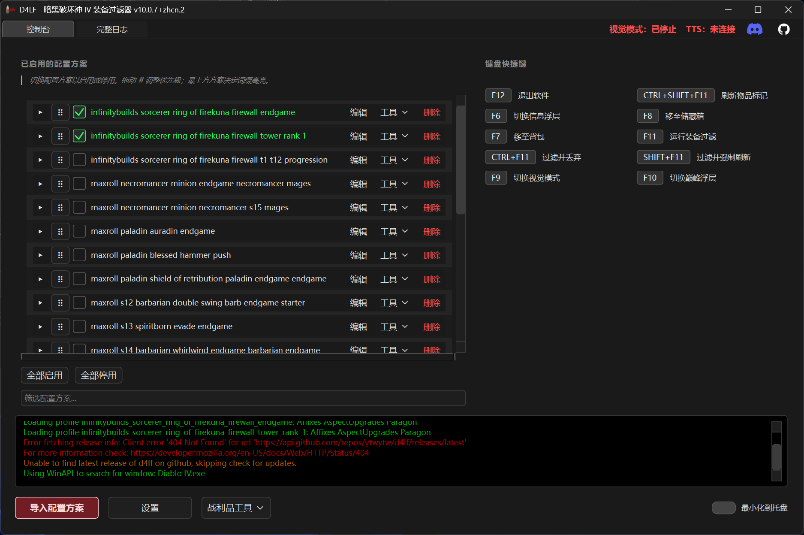
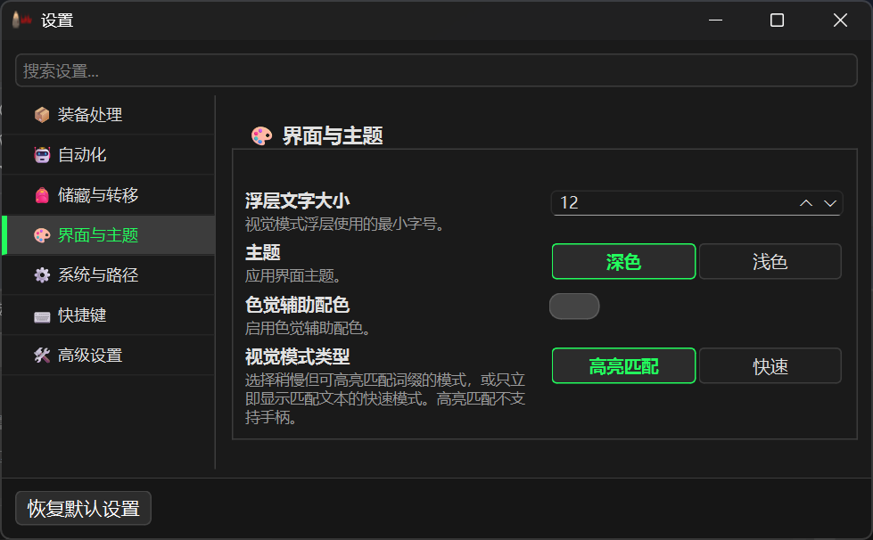
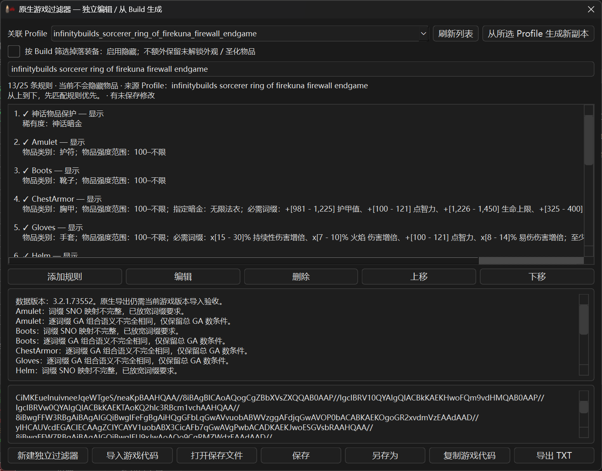
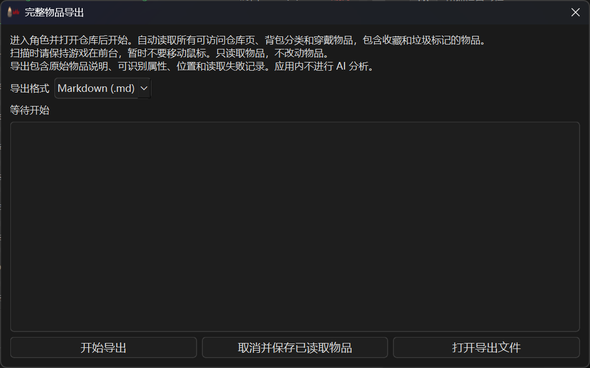
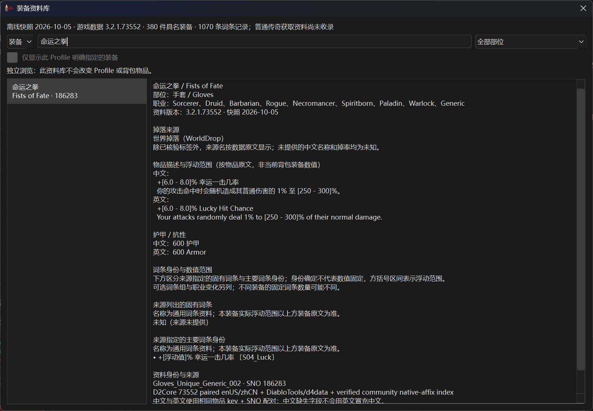

# D4LF 简体中文增强版

[English](README.en.md) · [安装](#%E5%AE%89%E8%A3%85) · [界面与配置](#%E7%95%8C%E9%9D%A2%E4%B8%8E%E9%85%8D%E7%BD%AE) · [战利品工具说明](docs/loot-tools.zh-CN.md)

D4LF 是《暗黑破坏神 IV》的 Windows 装备过滤工具。它按配置好的规则识别背包和仓库中的物品，
显示匹配结果，也可以自动标记未匹配的物品。

本版基于 [D4LF](https://github.com/d4lfteam/d4lf) V10，支持简体中文和英文游戏客户端。

## 主要功能

- **装备过滤**：按部位、物品强度、稀有度、词条和数值筛选装备。
- **Build 导入**：从配装网站导入方案，生成可编辑的过滤规则。
- **视觉模式**：悬停物品时显示匹配结果，或在物品说明中高亮匹配词条。
- **游戏过滤器**：根据已导入的方案生成游戏过滤器，也可独立创建规则并导出游戏代码。
- **物品导出**：扫描仓库、背包和穿戴物品，将物品说明、属性和位置保存为 Markdown、TXT 或 JSON。
- **装备资料库**：搜索装备，查看已收录的获取来源、词条和数值范围。
- **悬浮面板**：在游戏中查看巅峰盘方案、事件计时、金币和经验等信息。

## 安装

本页对应 **`10.0.7+zhcn.3`**。在 [Releases](https://github.com/ytwytw/d4lf/releases) 下载完整程序包
`d4lf_v<版本号>.zip`，本版改动见[版本说明](docs/release-notes.zh-CN.md)。

完整程序包的安装步骤：

1. 将程序包解压到新目录，保留其中的 EXE、assets 和其他文件。
1. 退出游戏，双击 `install_dll.cmd`，按提示选择游戏目录并安装本地签名证书。此步骤会替换游戏目录中的 `saapi64.dll`。
1. 启动 `d4lf.exe`，在 **设置 → 系统与路径 → 语言** 中选择游戏客户端使用的语言。
1. 在游戏中启用高级说明信息、屏幕阅读器和第三方屏幕阅读器；字体大小设为小或中，关闭 HDR。

> 本项目不是暴雪官方工具。使用第三方辅助工具存在账号风险，请自行判断。

## 开始使用

1. 点击 **导入配置方案**，导入 Build，然后在主界面勾选要使用的方案。Profile 即保存过滤规则的配置方案。
1. 在 **设置 → 自动化** 中开启“仅视觉模式”，在 **界面与主题** 中选择“快速”模式。按默认快捷键 `F9` 启动视觉模式，再悬停装备检查结果。
1. 确认规则后，关闭“仅视觉模式”即可使用自动操作。默认 `F11` 会运行装备过滤，并将未匹配的物品标记为垃圾。

支持从以下网站导入 Build：

[Maxroll](https://maxroll.gg/d4/) · [Mobalytics](https://mobalytics.gg/diablo-4/builds) ·
[D4Builds](https://d4builds.gg/) · [InfinityBuilds](https://infinitybuilds.gg/) · [暗黑核 D2Core](https://www.d2core.com/d4/planner)

中文和英文 Build 都可以用于中文或英文客户端。导入后可点击方案右侧的 **编辑** 调整规则。
网站或赛季更新可能导致部分词条无法导入，请检查导入结果及日志中的提示。
再次导入同名 Build 时，若原 Profile 已被修改，新导入会另存为 `名称_2`（依次递增），不会覆盖原文件；
内容未修改时直接更新原文件。勾选 **加入启用方案** 时会启用新文件，已启用的原方案不会自动取消，请在主界面按需调整。

导入时的保护：

- 只有 Build 网站的词条文字与 D4LF 的某个词条完全对应时才会采用，不会猜成相近的其他词条。
- 某个部位有词条无法识别时，该部位规则只要求能识别的词条；若无法识别的词条已足以满足 Build 的要求，
  该部位会保留同类所有其他条件匹配的物品（宁可多保留）。导入窗口会提示受影响的部位。
- Build 中有 D4LF 无法识别的物品（例如未知的暗金或符文之语、未知的物品类型、无法读取的护符或封印）时，
  整个导入会停止，不写入也不启用任何 Profile，并列出这些物品。可改为导入其他变体，或在 Build 中移除或替换后重新导入。
  未勾选导入护符或封印时，这两类中的此类条目不会阻止导入。

## 界面与配置

以下截图来自 `10.0.7+zhcn.2` 简体中文界面，点击可查看原图。Build 名称和部分日志保留来源语言。

### 主界面

勾选方案即可启用，搜索框用于查找方案，拖动六点手柄可调整顺序。
物品只要匹配任一已启用方案就会保留；最上方方案决定词条高亮。
每行的 **编辑** 用于修改规则，**工具** 可打开关联 Build 的游戏过滤器或装备资料。

截图时游戏未运行，因此 TTS 显示未连接；日志末尾的更新检查错误出现在首个正式版发布之前。

### 设置与视觉模式

在 **设置** 中调整物品分类、仓库页数、语言和快捷键。关闭某类物品的过滤后，该类物品会保持原状。

**界面与主题** 提供深色／浅色主题、浮层字号和两种视觉模式：

- **高亮匹配**：在物品说明中框出匹配的词条。
- **快速**：直接显示识别和匹配结果，支持手柄。

### 游戏过滤器

为游戏中的地面掉落设置显示、隐藏或颜色规则。
打开 **战利品工具 → 游戏过滤器生成器**，选择 Profile 后点击 **从所选 Profile 生成新副本**，
也可以点击 **新建独立过滤器** 从头编辑。

编辑完成后，点击 **复制游戏代码** 或 **导出 TXT**，再到游戏内导入。
部分 D4LF 规则无法直接转换，生成器会列出差异并提示是否会隐藏物品。
详细步骤见[游戏过滤器说明](docs/loot-tools.zh-CN.md#%E6%B8%B8%E6%88%8F%E8%BF%87%E6%BB%A4%E5%99%A8)。

### 物品导出

扫描可访问的仓库、背包和当前穿戴物品，将每件物品的原始说明、可识别属性、位置和读取状态保存到文件。
支持 **Markdown、TXT 和 JSON** 三种格式。

导出的文件可以交给 AI 分析。D4LF 只负责采集和导出物品信息，不提供内置 AI 分析。

进入角色并打开仓库，等待 TTS 连接后，点击 **战利品工具 → 完整物品导出**，选择格式并开始扫描。
文件默认保存在 `%USERPROFILE%\.d4lf\exports\inventory`。

导出内容以游戏屏幕阅读器提供的信息为准，未读取到的字段显示为未知。
看似为空的格子会再悬停一次确认，空格较多时扫描较慢。既没有读到物品、也无法确认为空的位置会在文件中单独列出，
此时扫描结果为“部分完成”。
操作步骤和文件说明见[物品导出说明](docs/loot-tools.zh-CN.md#%E5%AE%8C%E6%95%B4%E7%89%A9%E5%93%81%E5%AF%BC%E5%87%BA)。

### 装备资料库

打开 **战利品工具 → 装备来源与词条**，按中文名、英文名或部位搜索装备，
查看已收录的获取来源、物品说明、词条和数值范围。也可从 Profile 的 **工具** 菜单查看方案指定的装备。

资料随程序提供，版本和日期显示在窗口顶部。尚未收录的信息显示为未知，掉落资料可能与当前赛季不同。
收录范围见[装备资料说明](docs/loot-tools.zh-CN.md#%E8%A3%85%E5%A4%87%E6%9D%A5%E6%BA%90%E4%B8%8E%E8%AF%8D%E6%9D%A1)。

### 巅峰盘与信息面板

- **巅峰盘**：导入 Build 时选择导入巅峰数据，用默认 `F10` 显示或隐藏方案，按屏幕提示调整缩放与位置。
- **信息面板**：用默认 `F6` 显示或隐藏，拖动调整位置，右键设置事件计时、金币、经验和字号。
  金币与经验统计需要 TTS 连接；自动采集经验时，程序会移动鼠标到经验条。

快捷键可在 **设置 → 快捷键** 中查看和修改。详细操作见英文版的[巅峰盘](README.en.md#paragon-overlay)和[信息面板](README.en.md#info-panel-overlay)说明。

上游经典过滤效果（英文客户端）

上游历史截图，展示物品说明中的匹配词条高亮。

## 自定义过滤规则

点击方案右侧的 **编辑** 可以修改规则，也可以直接编辑 Profile 的 YAML 文件。
规则写法见[完整参考（英文）](README.en.md#how-to-filter--profiles)，包括词条数量、数值、百分比、
太古词条、威能、钥匙、贡品、封印、护符和暗金装备。

中文里同名的条目在编辑器中会附带英文名和简短说明，例如 `巨人贡品（tribute of heritage · 职业专属暗金物品）`
和 `毒素伤害（poison damage · 整数范围）`。请按说明选择；只输入同名文字不会选中任何条目。

## 升级与回退

1. 退出 D4LF，备份 `%USERPROFILE%\.d4lf` 和另存到其他位置的文件，保留旧程序目录。
1. 将新版本完整解压到新目录。同一 Windows 账户下，新版会继续读取原有配置。
1. 启动后检查语言、快捷键和已启用的 Profile。V9 升 V10 时，无法加载的 Profile 需要重新导入。
1. 先用“仅视觉模式”检查识别结果，再启用自动标记。

从旧版升级时使用完整程序包。只有版本说明要求更新游戏 DLL 时，才需退出游戏并重新运行 `install_dll.cmd`。
`9.3.7+zhcn.beta.5` 和 `beta.6` 已关闭自动更新，请按上述步骤手动下载并解压；本版 DLL 与这两个测试版相同，无需仅为升级重新安装。

使用自动更新器 `autoupdater.bat` 时，若提示 `d4lf.exe` 仍被占用，请关闭所有 D4LF 窗口（包括以管理员身份运行的）后重试，
此时已安装的文件不会被修改。若复制失败，可从完整程序包重新解压；不要混用不同版本的 EXE 和 assets。

需要回退时，先另存新版运行后的配置，再启动保留的旧程序。若旧版无法读取配置，恢复升级前的备份。
回退不会自动恢复游戏 DLL，DLL 的安装要求以对应版本说明为准。

## 文件位置

配置和导出文件默认位于 `%USERPROFILE%\.d4lf`：

| 路径                 | 内容                       |
| -------------------- | -------------------------- |
| `params.ini`         | 语言、快捷键和其他设置     |
| `profiles/`          | 装备过滤方案               |
| `native_filters/`    | 可继续编辑的游戏过滤器文件 |
| `exports/inventory/` | 物品导出文件               |
| `captures/`          | 诊断截图和文本             |

## 常见问题与反馈

- **TTS 无法连接**：检查游戏屏幕阅读器、第三方屏幕阅读器和 DLL 安装。仍无法连接时，可尝试以管理员身份运行游戏和启动器。
- **配置损坏**：退出 D4LF，备份并重命名 `params.ini`，再启动程序重新设置。错误详情位于程序目录下的 `logs`。
- **“恶毒”或“巨人贡品”显示为未知**：这两个中文名各对应两个不同条目。D4LF 只在同一物品说明中的效果文字能确认时识别，
  否则保持未知，不会猜测为其中任一条目。这一识别尚未在当前游戏中实测，相关物品可能始终显示为未知；
  使用相关规则前，请先在“仅视觉模式”下检查结果。
- **已启用的 Profile 文件缺失或无法读取**：D4LF 不会把未匹配的物品标记为垃圾或丢弃，带筛选的刷新也会保留现有标记；
  匹配的物品仍会标记为收藏。托盘和日志会列出受影响的方案。恢复或修复文件后自动恢复正常。
  无法读取的方案可在主界面取消勾选；已删除的方案不会显示在主界面，勾选或取消勾选任一方案后，启用列表会按当前显示的方案重新保存。
- **过滤器、导出或资料库出错**：参阅[战利品工具故障排查](docs/loot-tools.zh-CN.md#%E6%95%85%E9%9A%9C%E6%8E%92%E6%9F%A5)。

诊断功能可在高级设置中开启，默认关闭，文件保存在本机。
反馈问题请到 [GitHub Issues](https://github.com/ytwytw/d4lf/issues)，附上版本号、操作步骤和错误信息。
上传日志、截图或导出文件前，请检查其中是否包含个人信息。

## 致谢

感谢上游 [D4LF](https://github.com/d4lfteam/d4lf)、[暗黑核 D2Core](https://www.d2core.com/d4/planner) 及其他社区资料项目。
数据来源见[资料来源说明](assets/equipment_knowledge/NOTICE.md)，项目许可证见 [LICENSE](LICENSE)。
